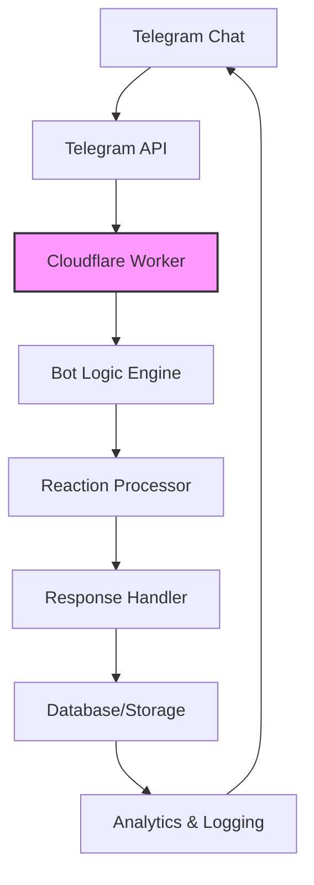

<p align="center">
  
</p>

<h2 align="center">
 <b>𝐑𝚵𝚫𝐂𝐓𝐈𝚯𝐍 𝐁𝐔𝐈𝐋𝐃𝚵𝐑 𝐁𝚯𝐓</b> 
</h2>
<div align="center">

[](https://workers.cloudflare.com)
[](https://t.me/ReactionBuilderBot)
[](https://opensource.org/licenses/MIT)
[](https://github.com/Shineii86/ReactionBuilderBot/releases)

[](https://github.com/Shineii86/ReactionBuilderBot/commits/main)
[](https://github.com/Shineii86/ReactionBuilderBot)
[](https://github.com/Shineii86/ReactionBuilderBot/issues)

[](https://github.com/Shineii86/ReactionBuilderBot/stargazers) [](https://github.com/Shineii86/ReactionBuilderBot/fork)

</div>

<h4 align="center">🚀 Advanced Telegram Bot for Automated Message Reactions • Built on Cloudflare Workers • 100% Serverless • Enterprise Ready</h4>

<div align="center">
  
[💬 Live Demo](https://t.me/ReactionBuilderBot) • 
[📚 Documentation](https://github.com/Shineii86/ReactionBuilderBot/wiki) • 
[🐛 Report Bug](https://github.com/Shineii86/ReactionBuilderBot/issues/new) • 
[💡 Feature Request](https://github.com/Shineii86/ReactionBuilderBot/discussions)

</div>

## ✨ Features

### 🎯 Core Features
- ✅ **Automatic Message Reactions** - Smart reaction system for all message types
- ✅ **Multi-Chat Support** - Simultaneous operation in groups, supergroups, and channels
- ✅ **Customizable Reaction Sets** - Fully configurable emoji library
- ✅ **Intelligent Randomization** - Adaptive reaction probability system
- ✅ **Real-time Processing** - Sub-second reaction times using Cloudflare's global network

### 🛡️ Enterprise Features
- ✅ **Serverless Architecture** - Zero infrastructure costs, auto-scaling
- ✅ **High Availability** - 99.9% uptime guaranteed by Cloudflare
- ✅ **Security First** - Environment variable protection, input validation
- ✅ **Comprehensive Logging** - Detailed activity monitoring and analytics
- ✅ **RESTful API** - Health checks, status endpoints, and configuration management

### 🔧 Advanced Capabilities
- ✅ **Smart Rate Limiting** - Prevents API abuse and ensures compliance
- ✅ **Selective Chat Restrictions** - Granular control over bot behavior
- ✅ **Donation System** - Integrated payment processing for supporter rewards
- ✅ **Multi-environment Support** - Development, staging, and production ready
- ✅ **Automated Deployment** - CI/CD with GitHub Actions

## 🚀 Quick Deploy

### 🌟 One-Click Deployment

[](https://deploy.workers.cloudflare.com/?url=https://github.com/Shineii86/ReactionBuilderBot)

[](https://vercel.com/new/clone?repository-url=https://github.com/Shineii86/ReactionBuilderBot)
[](https://app.netlify.com/start/deploy?repository=https://github.com/Shineii86/ReactionBuilderBot)

### 📦 Traditional Deployment Options

[](https://heroku.com/deploy?template=https://github.com/Shineii86/ReactionBuilderBot)
[](https://railway.app/template/ReactionBuilderBot?referralCode=shineii)
[](https://render.com/deploy?repo=https://github.com/Shineii86/ReactionBuilderBot)

## 📋 Prerequisites

Before deployment, ensure you have:

- [ ] **Telegram Bot Token** from [@BotFather](https://t.me/BotFather)
- [ ] **Cloudflare Account** (for Workers deployment)
- [ ] **GitHub Account** (for CI/CD and repository management)
- [ ] **Node.js 18+** (for local development)

## ⚙️ Configuration Guide

### 🔐 Environment Variables

Configure these essential variables in your deployment platform:

| Variable | Description | Example | Required |
|----------|-------------|---------|----------|
| `BOT_TOKEN` | Telegram Bot API token | `123456:ABC-DEF1234ghIkl-zyx57W2v1u123ew11` | ✅ |
| `BOT_USERNAME` | Your bot's username (without @) | `ReactionBuilderBot` | ✅ |
| `EMOJI_LIST` | Comma-separated emojis for reactions | `👍,❤️,🔥,🎉,👏,😂,😮,😢,🤔,👀` | ✅ |
| `RANDOM_LEVEL` | Reaction randomness (0-10) | `5` | ❌ (Default: 0) |
| `RESTRICTED_CHATS` | Chat IDs to exclude | `-100123456,789012345` | ❌ |

### 🎛️ Random Level Configuration

| Level | Behavior | Reaction Chance |
|-------|----------|----------------|
| 0 | Always react | 100% |
| 5 | Moderate randomness | 50% |
| 10 | Maximum randomness | 0% (Never reacts) |

## 🏗️ Architecture



## 🚀 Deployment Methods

### 🌐 Cloudflare Workers (Recommended)

#### Option 1: One-Click Deploy
1. Click the "Deploy to Cloudflare Workers" button above
2. Authorize with your Cloudflare account
3. Configure environment variables in the dashboard
4. Set webhook URL: `https://api.telegram.org/bot<BOT_TOKEN>/setWebhook?url=<YOUR_WORKER_URL>`

#### Option 2: Manual Wrangler Deployment
```bash
# Clone repository
git clone https://github.com/Shineii86/ReactionBuilderBot.git
cd ReactionBuilderBot

# Install dependencies
npm install

# Configure wrangler.toml
cp wrangler.example.toml wrangler.toml
# Edit wrangler.toml with your settings

# Deploy to Cloudflare
npx wrangler deploy
```

### 🔄 GitHub Actions Auto-Deploy

1. **Fork this repository**
2. **Add secrets to your repository**:
   - `CLOUDFLARE_API_TOKEN`
   - `CLOUDFLARE_ACCOUNT_ID`
   - `BOT_TOKEN`
   - `BOT_USERNAME`
   - `EMOJI_LIST`
   - `RANDOM_LEVEL`
   - `RESTRICTED_CHATS`

3. **Run the deployment workflow**:
   - Navigate to **Actions** → **🚀 Deploy to Cloudflare Workers** → **Run workflow**

## 📡 Webhook Configuration

After deployment, configure your Telegram webhook:

```bash
# Set webhook
curl -X POST https://api.telegram.org/bot<YOUR_BOT_TOKEN>/setWebhook \
  -H "Content-Type: application/json" \
  -d '{"url": "https://your-worker.your-subdomain.workers.dev"}'

# Verify webhook
curl https://api.telegram.org/bot<YOUR_BOT_TOKEN>/getWebhookInfo
```

## 🎮 Bot Commands

| Command | Description | Usage |
|---------|-------------|-------|
| `/start` | Initialize bot and show welcome message | `/start` |
| `/reactions` | Display available reaction emojis | `/reactions` |
| `/donate` | Support bot development | `/donate` |
| `/help` | Show help information | `/help` |
| `/stats` | Display bot statistics | `/stats` |

## 🔍 Monitoring & Analytics

### 📊 Health Checks

```bash
# Check bot health
curl https://your-worker.your-subdomain.workers.dev/health

# Response:
{
  "status": "healthy",
  "timestamp": "2024-01-15T10:30:00.000Z",
  "version": "2.1.0",
  "bot": {
    "username": "ReactionBuilderBot",
    "healthy": true,
    "reactions": 15,
    "restricted_chats": 2
  }
}
```

### 📈 Status Endpoints

| Endpoint | Description | Method |
|----------|-------------|--------|
| `/health` | Comprehensive health check | GET |
| `/status` | Bot status and statistics | GET |
| `/config` | Configuration overview | GET |

## 🛠️ Development

### 🏃‍♂️ Local Development

```bash
# Clone the repository
git clone https://github.com/Shineii86/ReactionBuilderBot.git
cd ReactionBuilderBot

# Install dependencies
npm install

# Set up environment variables
cp .env.example .env
# Edit .env with your configuration

# Start local development server
npm run dev

# Run tests
npm test

# Build for production
npm run build
```

### 🧪 Testing

```bash
# Run unit tests
npm test

# Run with coverage
npm run test:coverage

# Run integration tests
npm run test:integration
```

## 🤝 Contributing

We love your input! We want to make contributing as easy and transparent as possible.

### 📝 How to Contribute

1. **Fork the repository**
2. **Create a feature branch**: `git checkout -b feature/amazing-feature`
3. **Commit your changes**: `git commit -m 'Add amazing feature'`
4. **Push to the branch**: `git push origin feature/amazing-feature`
5. **Open a Pull Request**

### 🐛 Reporting Issues

When [reporting issues](https://github.com/Shineii86/ReactionBuilderBot/issues/new), please include:

- Detailed description of the problem
- Steps to reproduce
- Expected vs actual behavior
- Screenshots (if applicable)
- Environment information

## 📈 Performance Metrics

| Metric | Value | Description |
|--------|-------|-------------|
| **Response Time** | < 100ms | Average reaction time |
| **Uptime** | 99.9% | Service reliability |
| **Scalability** | Infinite | Automatic scaling with demand |
| **Cost** | $0/month* | Free tier sufficient for most use cases |

*Based on Cloudflare Workers free tier

## 🏆 Credits & Acknowledgments

### 👨‍💻 Core Development Team
- **[Shinei Nouzen](https://github.com/Shineii86)** - Lead Developer & Maintainer
- **[Malith Rukshan](https://github.com/Malith-Rukshan/Auto-Reaction-Bot)** - Original Concept & Inspiration

### 🔧 Technologies Used
- [Telegram Bot API](https://core.telegram.org/bots/api) - Official Telegram API
- [Cloudflare Workers](https://workers.cloudflare.com) - Serverless platform
- [Node.js](https://nodejs.org) - JavaScript runtime
- [Wrangler](https://developers.cloudflare.com/workers/wrangler/) - Development tool

### 🙌 Special Thanks
- **Telegram API Team** for continuous improvements
- **Cloudflare Team** for amazing serverless platform
- **Open Source Community** for contributions and feedback

## 📄 License

This project is licensed under the MIT License - see the [LICENSE](LICENSE) file for details.

## 🔗 Useful Links

- 📚 [Full Documentation](https://github.com/Shineii86/ReactionBuilderBot/wiki)
- 💬 [Support Chat](https://telegram.me/MaximXGroup)
- 🔔 [Update Channel](https://telegram.me/MaximXBots)
- 🐛 [Issue Tracker](https://github.com/Shineii86/ReactionBuilderBot/issues)
- 💡 [Feature Requests](https://github.com/Shineii86/ReactionBuilderBot/discussions)

## ⭐ Support the Project

If you find this project helpful, please consider:

1. **Giving a Star** ⭐ on GitHub
2. **Sharing** with your network
3. **Contributing** code or documentation
4. **Donating** to support development

---

## 💕 Loved My Work?

🚨 [Follow me on GitHub](https://github.com/Shineii86)

⭐ [Give a star to this project](https://github.com/Shineii86/AniList)

<div align="center">

<a href="https://github.com/Shineii86/ReactionBuilderBot">

</a>
  
  *For inquiries or collaborations*
     
[](https://telegram.me/Shineii86 "Contact on Telegram")
[](https://instagram.com/ikx7.a "Follow on Instagram")
[](https://pinterest.com/ikx7a "Follow on Pinterest")
[](mailto:ikx7a@hotmail.com "Send an Email")

  <sup><b>Copyright © 2025 <a href="https://telegram.me/Shineii86">Shinei Nouzen</a> All Rights Reserved</b></sup>


</div>
